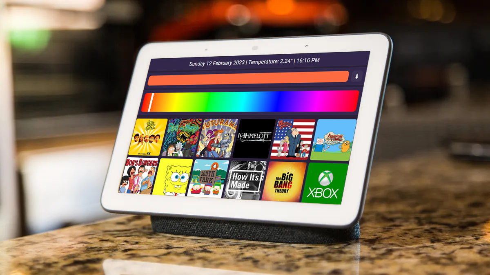

# Maxi's Configuration of Home-Assistant
As promised, a repo with most of my config files.
Do not hesitate to open up an issue if you have any specific question on the YAML code I made.

## Main Tablet interface

Here you can find some images of the main tablet interface. 
Its code is under ".storage/lovelace.tablet_entrance_dashboard"

  
  
  

  
  
  
  

  
## Hotbox Top hub
This is the default interface for the hotbox top Google Nest.
It offers preselected shows, lights control and current media playback control.
It also has a quick-access to set the TV's input on the Xbox one.

Its code is under ".storage/lovelace.lovelace_hub"

  

